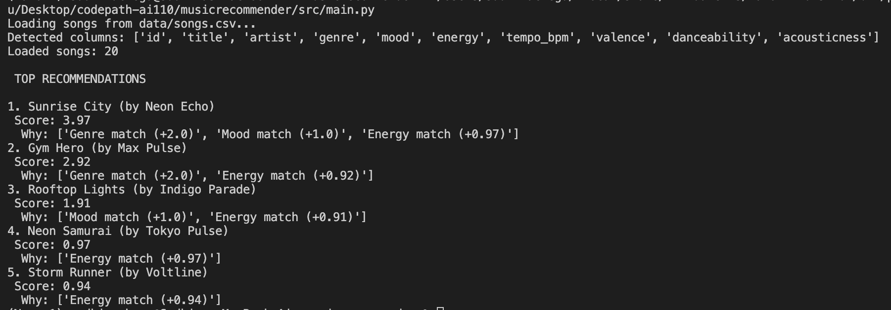
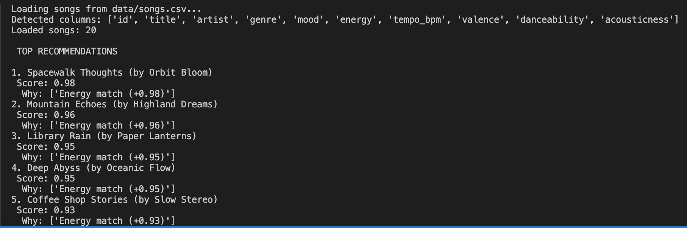
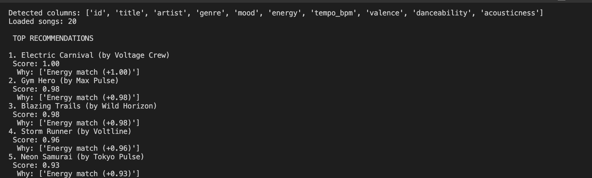

# 🎵 Music Recommender Simulation

## Project Summary

I built a content-based recommendation engine called VectorVibeMatch. The system analyzes a catalog of songs and compares their metadata (genre, mood, and energy) against a specific user preference profile. By applying a weighted mathematical scoring rule, it identifies which songs "vibe" best with the user and presents a ranked list of suggestions with clear explanations for why each song was chosen.

---

## How The System Works


Real-world recommenders track millions of users habits, but my  version would use pure content-based filtering to match a song's vibe directly to a user's taste. It will  score tracks based on exact genre and mood matches, plus a math rule that rewards songs with an energy level closest to the user's target. Finally, it will rank the entire catalog by these scores and recommends the top matches.

- Each Song utilizes categorical features (genre, mood) and continuous numerical features (energy, tempo_bpm).

- The UserProfile stores the user's target preferences for their desired genre, mood, and energy level.

- The Recommender computes a score by adding points for exact genre or mood matches, plus a mathematical proximity bonus for matching energy.

- The system chooses recommendations by sorting all scored songs in descending order and returning the top k highest-scoring tracks.

The Algorithm Recipe:
The system calculates a similarity score for each track against a user's target profile using the following weighted logic:

Genre Match: +2.0 points (High priority for baseline filtering).

Mood Match: +1.0 points (Secondary categorical filter).

Energy Proximity: Up to +1.0 point, calculated inversely based on the absolute difference between the user's target energy and the song's energy.

Expected Biases:
Because this is a rigid, rules-based heuristic model rather than a trained neural network, it is highly biased toward exact string matches. It will likely over-prioritize genre, creating a "filter bubble" where a user might miss out on a great song with a matching mood and energy simply because its genre label is slightly different.

---

## Getting Started

### Setup

1. Create a virtual environment (optional but recommended):

   ```bash
   python -m venv .venv
   source .venv/bin/activate      # Mac or Linux
   .venv\Scripts\activate         # Windows

2. Install dependencies

```bash
pip install -r requirements.txt
```

3. Run the app:

```bash
python -m src.main
```

### Running Tests

Run the starter tests with:

```bash
pytest
```

You can add more tests in `tests/test_recommender.py`.

---
 

 

## Experiments You Tried

The Weight Shift Experiment: I tested the system's sensitivity by halving the importance of the genre match (from 2.0 to 1.0) and doubling the weight of the energy proximity. This significantly changed the results; songs that were previously buried because of a genre mismatch rose to the top because their "energy vibe" was a near-perfect match.

The Case Sensitivity Test: I discovered that the system is highly sensitive to formatting. Initially, using capitalized "Pop" for a lowercase "pop" entry resulted in a score of 0.0 for that category. Fixing this to lowercase ensured the categorical logic triggered correctly.

Adversarial Profiling: I tested a "Conflicting Profile" (High Energy + Sad Mood). The system revealed its mechanical nature here—it couldn't "understand" that these traits are often opposites in the dataset, so it simply picked the best mathematical middle ground, which didn't always feel like a cohesive musical choice.
---

## Limitations and Risks


Exact Match Bias: The system relies on exact string matching. If a song is labeled "Lo-fi" and the user asks for "Lofi," the system sees no match at all, creating a "filter bubble."

Cold-Start Metadata: The system is only as good as the CSV data. If the energy or mood labels are subjective or poorly assigned by the data entry person, the recommendations will be inaccurate.

Lack of Diversity: Because the catalog is small (20 songs), a user might get the same 5 recommendations repeatedly, leading to a stagnant user experience.

---

## Reflection

Through this project, I learned that recommendation systems are essentially "weighted translation layers." They take human concepts like "mood" or "energy" and translate them into mathematical distances. I was surprised by how much power the developer has in this process—by simply changing a few numbers in the score_song function, I could completely change what a user sees, which highlights how easily developer bias can steer a user's experience without them knowing.

Bias shows up most clearly in how we weigh features. By over-weighting genre, I unintentionally created a system that discourages discovery. This mirrors real-world echo chambers, where an algorithm might keep showing a user the same type of content because it’s the "safest" mathematical match, eventually narrowing the user's perspective or taste over time.


---

## 7. `model_card_template.md`

Combines reflection and model card framing from the Module 3 guidance. :contentReference[oaicite:2]{index=2}  

```markdown
# 🎧 Model Card - Music Recommender Simulation

## 1. Model Name

Give your recommender a name, for example:

> VibeFinder 1.0

---

## 2. Intended Use

- What is this system trying to do
- Who is it for

Example:

> This model suggests 3 to 5 songs from a small catalog based on a user's preferred genre, mood, and energy level. It is for classroom exploration only, not for real users.

---

## 3. How It Works (Short Explanation)

Describe your scoring logic in plain language.

- What features of each song does it consider
- What information about the user does it use
- How does it turn those into a number

Try to avoid code in this section, treat it like an explanation to a non programmer.

---

## 4. Data

Describe your dataset.

- How many songs are in `data/songs.csv`
- Did you add or remove any songs
- What kinds of genres or moods are represented
- Whose taste does this data mostly reflect

---

## 5. Strengths

Where does your recommender work well

You can think about:
- Situations where the top results "felt right"
- Particular user profiles it served well
- Simplicity or transparency benefits

---

## 6. Limitations and Bias

Where does your recommender struggle

Some prompts:
- Does it ignore some genres or moods
- Does it treat all users as if they have the same taste shape
- Is it biased toward high energy or one genre by default
- How could this be unfair if used in a real product

---

## 7. Evaluation

How did you check your system

Examples:
- You tried multiple user profiles and wrote down whether the results matched your expectations
- You compared your simulation to what a real app like Spotify or YouTube tends to recommend
- You wrote tests for your scoring logic

You do not need a numeric metric, but if you used one, explain what it measures.

---

## 8. Future Work

If you had more time, how would you improve this recommender

Examples:

- Add support for multiple users and "group vibe" recommendations
- Balance diversity of songs instead of always picking the closest match
- Use more features, like tempo ranges or lyric themes

---

## 9. Personal Reflection

A few sentences about what you learned:

- What surprised you about how your system behaved
- How did building this change how you think about real music recommenders
- Where do you think human judgment still matters, even if the model seems "smart"

